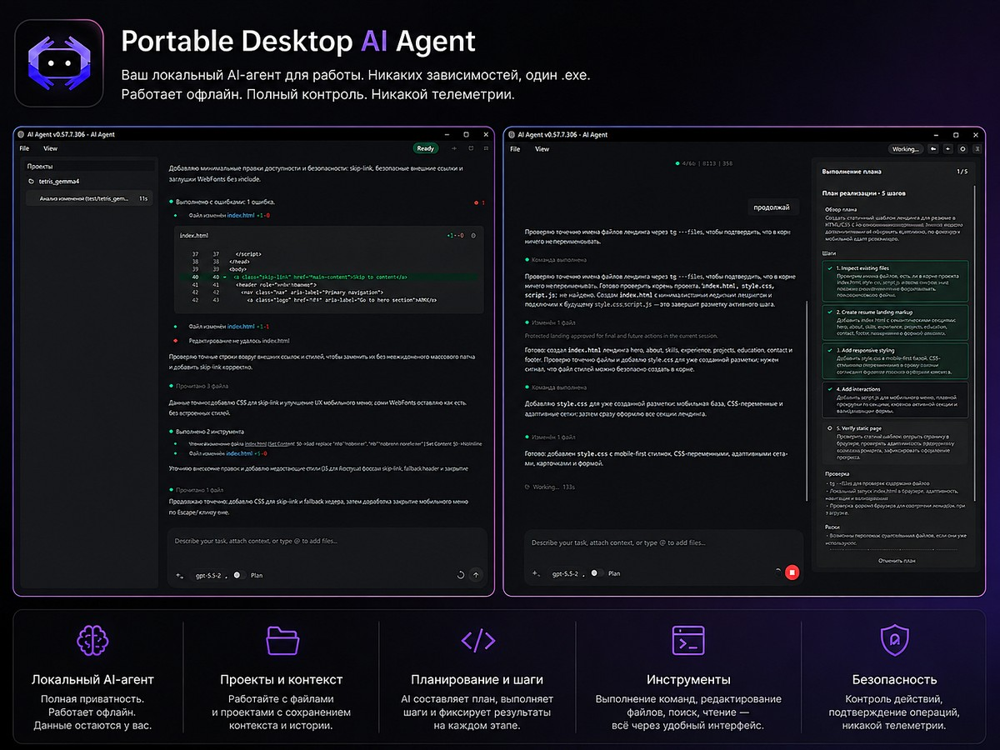

# Portable Autonomous AI Agent (GUI)

> *“Created by a SysAdmin for developers. Focus on safety, portability, and zero-nonsense execution. No Docker, no heavy environments, just one binary.”*

Десктопный AI-агент с runtime на `LangGraph` и графическим интерфейсом на `PySide6`.  
Работает с файлами, shell-командами, системой, MCP-серверами и веб-поиском.

Запуск из исходников: `python main.py`.  
Сборка в portable `.exe` для Windows: `build.bat`.



---

## Возможности

- Графовый runtime на `LangGraph` с bounded recovery и self-correction
- GUI: история чатов, streaming transcript, tool cards, approvals, вложения
- Инструменты: filesystem, shell, web search, system info, process management, MCP
- Approval-паузы перед мутирующими и деструктивными действиями
- Автосуммаризация контекста при длинных сессиях
- Несколько профилей моделей с переключением прямо в GUI
- Durable checkpoints — сессии сохраняются между запусками
- Опциональный image input, если модель его поддерживает

---

## Быстрый Старт

Требования: **Python 3.10+**, API-ключ Gemini или OpenAI.

```powershell
python -m venv venv
venv\Scripts\pip.exe install -r requirements.txt
Copy-Item env_example.txt .env
# Открой .env и укажи API-ключ
python main.py
```

---

## Portable Сборка

```powershell
.\build.bat
```

Использует `PyInstaller` в режиме `--onefile --windowed`. Результат — один `.exe` без зависимостей.

---

## Runtime Flow

```text
START
  → summarize        # сжать контекст если сессия стала большой
  → update_step
  → agent            # LLM решает: ответить / вызвать tool / recovery
     → approval      # пауза перед мутирующим действием
        → tools
     → tools         # исполнить tool calls
        → recovery   # если tool вернул ошибку
        → update_step
     → recovery      # если агент вернул protocol error или loop
        → update_step
        → END
     → END
```

- `MAX_LOOPS` и per-tool loop guards предотвращают бесконечные циклы.
- Recovery намеренно минимальный: `active_issue`, `active_strategy` и счётчики без очередей.
- `SELF_CORRECTION_RETRY_LIMIT` задаёт жёсткий потолок попыток автоисправления.

---

## GUI

**Transcript** — streaming-ответы, tool cards с аргументами и результатами, summary-сообщения, статусные notice.

**Composer:**
- Вставка файлов через `Add files…`, drag-and-drop или clipboard paste
- `@`-mention popup с файлами и директориями текущего workspace (обновляется динамически)
- Нормализация текста перед отправкой: `\r\n` → `\n`, удаление control-символов
- Лимит 10 000 символов на запрос с inline-предупреждением при усечении

**Горячие клавиши:**

| Клавиша | Действие |
|---|---|
| `Enter` | Отправить сообщение |
| `Shift+Enter` | Новая строка |
| `Ctrl+N` | Новый чат |
| `Ctrl+B` | Показать / скрыть боковую панель |
| `Ctrl+I` | Info popup |
| `↑` / `↓` в пустом composer | История отправленных сообщений |

---

## Безопасность

- Approvals включены по умолчанию для write, delete, move и process-launch операций
- Shell-команды классифицируются перед выполнением (read-only / mutating / destructive)
- MCP tools требуют approval, если `policy.read_only` явно не выставлен в `true`
- Tool errors переводят выполнение в recovery, не игнорируются
- Workspace boundary check: мутирующие операции не могут выйти за пределы рабочей папки
- API keys, bearer tokens и query tokens редактируются из логов через `SensitiveDataFilter`
- `MAX_BACKGROUND_PROCESSES` ограничивает количество фоновых процессов

`request_user_input` — отдельный инструмент для блокирующего выбора пользователя:
- не более одного вызова за ход
- нельзя батчить с другими tool calls в одном ответе

---

## Профили Моделей

Несколько профилей моделей хранятся через `core/model_profiles.py` и переключаются в GUI.

Каждый профиль содержит: провайдера, имя модели, API key, опциональный `base_url` для OpenAI-compatible бэкендов, флаг image input, статус enabled/disabled.

- Активный профиль выбирается в GUI; `.env` используется только для bootstrap начального набора
- Legacy-ключи `MODEL`, `API_KEY`, `BASE_URL` поддерживаются для import/совместимости
- Для Gemini-профилей `base_url` игнорируется

---

## Сессии и Checkpoints

- Graph checkpoints: `sqlite` (по умолчанию) или `memory`
- `.agent_state/checkpoints.sqlite` — durable checkpoint store
- `.agent_state/session.json` — активная сессия
- `.agent_state/session_index.json` — индекс всех сессий
- `logs/runs/` — JSONL-логи каждого запуска

---

## MCP

`mcp.json` задаёт опциональные MCP-серверы. Все серверы выключены по умолчанию.

Поведение policy:

| `policy.read_only` | Поведение |
|---|---|
| `true` | Tool считается read-only, approval не требуется |
| `false` | Требует approval |
| не указан | Консервативный режим: approval по умолчанию |

Минимальный пример подключения удалённого сервера:

```json
{
  "context7": {
    "type": "remote",
    "url": "https://mcp.context7.com/mcp",
    "transport": "http",
    "enabled": true,
    "policy": {
      "read_only": true
    }
  }
}
```

---

## Prompt Layers

Промпт собирается из нескольких слоёв при каждом вызове агента:

| Слой | Файл / модуль | Содержимое |
|---|---|---|
| Базовый | `prompt.txt` | Системный промпт агента |
| Runtime | `core/runtime_prompt_policy.py` | OS, shell, workspace, дата, tool policy |
| Safety | `core/context_builder.py` | Workspace boundary, shell warning |
| Recovery | `core/recovery_manager.py` | Инструкции при активной ошибке |
| Memory | state: `summary` | Автосуммаризованный контекст прошлых ходов |

---

## Конфигурация

Все настройки читаются из `.env` через `core/config.py`. Скопируй `env_example.txt` в `.env` и заполни нужные поля.

### Провайдер и модели

| Переменная | По умолчанию | Описание |
|---|---|---|
| `PROVIDER` | `gemini` | `gemini` или `openai` |
| `GEMINI_API_KEY` | — | Обязателен для Gemini |
| `GEMINI_MODEL` | `gemini-1.5-flash` | Имя модели Gemini |
| `OPENAI_API_KEY` | — | Обязателен для OpenAI (если нет `OPENAI_BASE_URL`) |
| `OPENAI_MODEL` | `gpt-4o` | Имя модели OpenAI |
| `OPENAI_BASE_URL` | — | Для OpenAI-compatible бэкендов (Ollama и др.) |

### Управление runtime

| Переменная | Описание |
|---|---|
| `TEMPERATURE` | Температура модели |
| `MAX_LOOPS` | Максимум шагов на один запрос (default: 50) |
| `TOOL_LOOP_WINDOW` | Окно истории для детекции дублей tool calls |
| `TOOL_LOOP_LIMIT_MUTATING` | Лимит повторов для мутирующих инструментов |
| `TOOL_LOOP_LIMIT_READONLY` | Лимит повторов для read-only инструментов |
| `SELF_CORRECTION_RETRY_LIMIT` | Потолок попыток self-correction |

### Фиче-флаги

| Переменная | Описание |
|---|---|
| `MODEL_SUPPORTS_TOOLS` | Включить tool calling |
| `ENABLE_FILESYSTEM_TOOLS` | Инструменты для работы с файлами |
| `ENABLE_SHELL_TOOL` | Shell-выполнение команд |
| `ENABLE_SEARCH_TOOLS` | Web search через Tavily |
| `ENABLE_SYSTEM_TOOLS` | Информация о системе |
| `ENABLE_PROCESS_TOOLS` | Управление процессами |
| `ENABLE_APPROVALS` | Approval-паузы перед рискованными действиями |
| `ALLOW_EXTERNAL_PROCESS_CONTROL` | Разрешить управление внешними процессами |

### Лимиты

| Переменная | Описание |
|---|---|
| `MAX_FILE_SIZE` | Максимальный размер файла (поддерживает `300MB`, `4096`) |
| `MAX_READ_LINES` | Лимит строк при чтении файла |
| `MAX_TOOL_OUTPUT` | Лимит символов в выводе инструмента |
| `MAX_SEARCH_CHARS` | Лимит символов в результатах поиска |
| `MAX_BACKGROUND_PROCESSES` | Лимит фоновых процессов |
| `STREAM_TEXT_MAX_CHARS` | Лимит символов streaming-текста |
| `STREAM_EVENTS_MAX` | Лимит streaming-событий |
| `STREAM_TOOL_BUFFER_MAX` | Буфер streaming tool output |

### Суммаризация и retry

| Переменная | Описание |
|---|---|
| `SESSION_SIZE` | Порог токенов для запуска суммаризации |
| `SUMMARY_KEEP_LAST` | Сколько последних сообщений не трогать при суммаризации |
| `MAX_RETRIES` | Число попыток при ошибке LLM |
| `RETRY_DELAY` | Задержка между попытками (секунды) |

### Персистентность

| Переменная | По умолчанию | Описание |
|---|---|---|
| `CHECKPOINT_BACKEND` | `sqlite` | `sqlite` или `memory` |
| `CHECKPOINT_SQLITE_PATH` | `.agent_state/checkpoints.sqlite` | Путь к БД |
| `SESSION_STATE_PATH` | `.agent_state/session.json` | Активная сессия |
| `RUN_LOG_DIR` | `logs/runs` | Директория JSONL-логов |
| `LOG_FILE` | `logs/agent.log` | Файл лога |
| `PROMPT_PATH` | `prompt.txt` | Путь к системному промпту |
| `MCP_CONFIG_PATH` | `mcp.json` | Путь к конфигу MCP |

### Диагностика

| Переменная | Описание |
|---|---|
| `DEBUG` | Включить debug-режим |
| `LOG_LEVEL` | Уровень логирования (`INFO`, `DEBUG`, `WARNING`) |
| `STRICT_MODE` | Строгий режим: без догадок, точное выполнение |

---

## Структура Проекта

```text
.
├── agent.py              # Сборка и маршрутизация LangGraph графа
├── main.py               # Точка входа
├── build.bat             # Сборка portable .exe
├── prompt.txt            # Системный промпт агента
├── prompt_dev.txt        # Dev-вариант промпта для отладки
├── mcp.json              # Конфиг MCP-серверов
├── env_example.txt       # Шаблон .env
├── requirements.txt
├── core/                 # Runtime: граф, конфиг, policy, recovery, сессии
├── tools/                # Встроенные инструменты и MCP-интеграция
│   └── filesystem_impl/  # Низкоуровневая реализация filesystem-операций
├── ui/                   # Qt GUI: окно, виджеты, streaming, runtime bridge
│   ├── window_components/ # Builders и controllers главного окна
│   └── widgets/          # Composer, transcript и вспомогательные виджеты
└── tests/                # Тесты
```

---

## Тесты

```powershell
venv\Scripts\python.exe -m unittest discover -s tests -p "test_*.py"
```

Или через `pytest`, если установлен:

```powershell
venv\Scripts\python.exe -m pytest
```

Покрытие включает: runtime graph, approvals, recovery, policy engine, session storage, checkpoints, model profiles, GUI и composer UX.

---

## Зависимости

| Пакет | Назначение |
|---|---|
| `langgraph` | Граф агента и state management |
| `langchain` | LLM abstraction, tool calling |
| `langchain-google-genai` | Gemini provider |
| `langchain-openai` | OpenAI / compatible provider |
| `langchain-mcp-adapters` | MCP интеграция |
| `PySide6` | GUI |
| `pydantic-settings` | Конфигурация через `.env` |
| `tiktoken` | Подсчёт токенов для суммаризации |
| `tavily-python` | Web search |
| `psutil` | Системные инструменты и процессы |
| `httpx` | HTTP для MCP и fetch |
| `aiofiles` | Async файловые операции |
